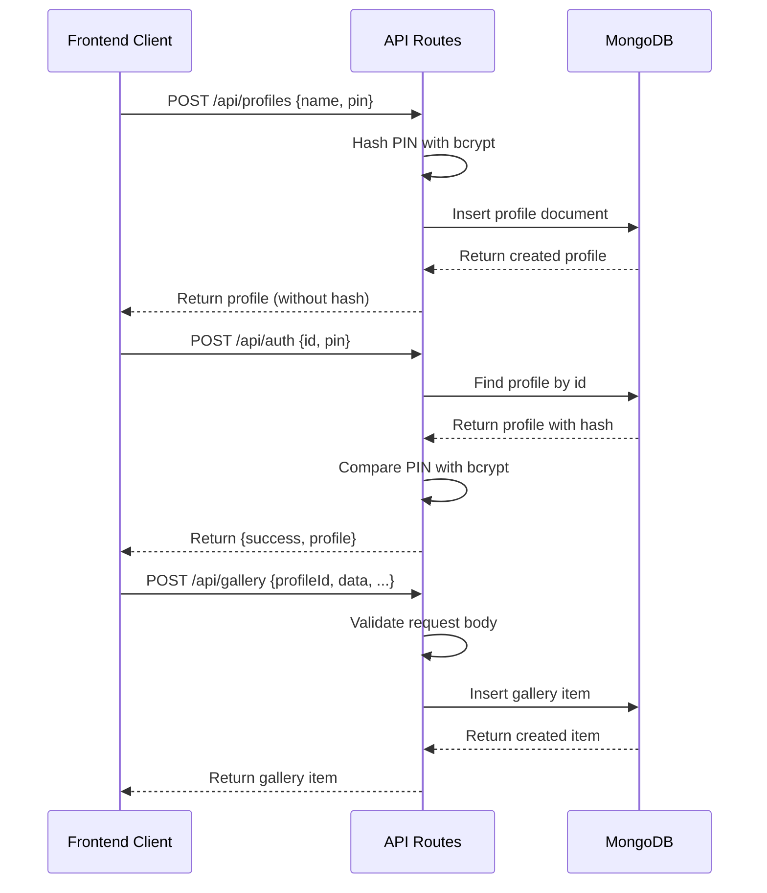

# Design Document: API Endpoints Implementation

## Overview

Implement backend API endpoints for TanStack Start application using file-based routing to support profile management, authentication, and gallery operations. All endpoints will use MongoDB for persistence with proper security (bcrypt for PIN hashing), validation, and error handling.

## Main Algorithm/Workflow



## Core Interfaces/Types

```typescript
// Request/Response Types
interface CreateProfileRequest {
  name: string;
  pin: string;
}

interface CreateProfileResponse {
  id: string;
  name: string;
  pin_hash: string;
  created_at: number;
}

interface AuthRequest {
  id: string;
  pin: string;
}

interface AuthResponse {
  success: boolean;
  profile?: {
    id: string;
    name: string;
    pin_hash: string;
    created_at: number;
  };
}

interface CreateGalleryItemRequest {
  profileId: string;
  topicSlug: string;
  data: string;
  caption: string;
  difficulty: "Easy" | "Medium" | "Hard";
}

interface GalleryItemResponse {
  id: string;
  profile_id: string;
  topic_slug: string;
  data: string;
  caption: string;
  difficulty: "Easy" | "Medium" | "Hard";
  created_at: number;
}

interface ImportGalleryRequest {
  profileId: string;
  items: Array<Omit<GalleryItemResponse, "id" | "created_at">>;
}

// TanStack Start API Handler Types
interface APIContext {
  request: Request;
}

type APIHandler = (context: APIContext) => Promise<Response>;
```

## Key Functions with Formal Specifications

### Function 1: hashPin()

```typescript
async function hashPin(pin: string): Promise<string>
```

**Preconditions:**
- `pin` is a non-empty string
- `pin.length >= 4` (minimum PIN length)
- bcrypt library is available

**Postconditions:**
- Returns a bcrypt hashed string
- Hash is different from plain text PIN
- Hash can be verified with bcrypt.compare()

**Loop Invariants:** N/A (no loops)

### Function 2: verifyPin()

```typescript
async function verifyPin(pin: string, hash: string): Promise<boolean>
```

**Preconditions:**
- `pin` is a non-empty string
- `hash` is a valid bcrypt hash string
- bcrypt library is available

**Postconditions:**
- Returns boolean indicating match
- `true` if and only if pin matches the hash
- No side effects on parameters

**Loop Invariants:** N/A (no loops)

### Function 3: generateId()

```typescript
function generateId(): string
```

**Preconditions:**
- crypto.randomUUID is available OR Date.now() is available

**Postconditions:**
- Returns a unique string identifier
- ID format: UUID or timestamp-based
- No collisions within reasonable time window

**Loop Invariants:** N/A (no loops)

### Function 4: validateProfileRequest()

```typescript
function validateProfileRequest(body: unknown): body is CreateProfileRequest
```

**Preconditions:**
- `body` parameter is provided (may be any type)

**Postconditions:**
- Returns boolean type guard
- `true` if body has valid `name` and `pin` properties
- Type narrowing applies when returns true

**Loop Invariants:** N/A (no loops)

### Function 5: validateGalleryRequest()

```typescript
function validateGalleryRequest(body: unknown): body is CreateGalleryItemRequest
```

**Preconditions:**
- `body` parameter is provided (may be any type)

**Postconditions:**
- Returns boolean type guard
- `true` if body has all required gallery item properties
- Validates difficulty enum values

**Loop Invariants:** N/A (no loops)

## Algorithmic Pseudocode

### Profile Creation Algorithm

```typescript
ALGORITHM createProfile(request)
INPUT: request of type Request
OUTPUT: response of type Response

BEGIN
  // Step 1: Parse and validate request
  body ← await request.json()
  ASSERT validateProfileRequest(body)
  
  IF NOT (body.name AND body.pin) THEN
    RETURN Response({error: "Missing required fields"}, {status: 400})
  END IF
  
  IF body.pin.length < 4 THEN
    RETURN Response({error: "PIN must be at least 4 characters"}, {status: 400})
  END IF
  
  // Step 2: Hash PIN and generate ID
  pinHash ← await hashPin(body.pin)
  profileId ← generateId()
  timestamp ← Date.now()
  
  // Step 3: Create profile document
  profile ← {
    id: profileId,
    name: body.name,
    pin_hash: pinHash,
    created_at: timestamp
  }
  
  // Step 4: Insert into database
  db ← await getDatabase()
  TRY
    await db.collection('profiles').insertOne(profile)
  CATCH error
    RETURN Response({error: "Database error"}, {status: 500})
  END TRY
  
  // Step 5: Return created profile
  RETURN Response(profile, {status: 201})
END
```

**Preconditions:**
- Request contains valid JSON body
- MongoDB connection is available
- bcrypt library is loaded

**Postconditions:**
- Profile is created in database if successful
- Returns 201 status with profile data on success
- Returns 400 for validation errors, 500 for database errors
- PIN is never stored in plain text

**Loop Invariants:** N/A

### Authentication Algorithm

```typescript
ALGORITHM authenticateProfile(request)
INPUT: request of type Request
OUTPUT: response of type Response

BEGIN
  // Step 1: Parse and validate request
  body ← await request.json()
  
  IF NOT (body.id AND body.pin) THEN
    RETURN Response({success: false}, {status: 401})
  END IF
  
  // Step 2: Fetch profile from database
  db ← await getDatabase()
  profile ← await db.collection('profiles').findOne({id: body.id})
  
  IF profile = null THEN
    RETURN Response({success: false}, {status: 401})
  END IF
  
  // Step 3: Verify PIN
  isValid ← await verifyPin(body.pin, profile.pin_hash)
  
  IF isValid THEN
    RETURN Response({success: true, profile: profile}, {status: 200})
  ELSE
    RETURN Response({success: false}, {status: 401})
  END IF
END
```

**Preconditions:**
- Request contains valid JSON body with id and pin
- MongoDB connection is available
- bcrypt library is loaded

**Postconditions:**
- Returns 200 with profile data if authentication successful
- Returns 401 if credentials invalid
- No information leakage about whether profile exists

**Loop Invariants:** N/A

### Gallery Item Creation Algorithm

```typescript
ALGORITHM createGalleryItem(request)
INPUT: request of type Request
OUTPUT: response of type Response

BEGIN
  // Step 1: Parse and validate request
  body ← await request.json()
  ASSERT validateGalleryRequest(body)
  
  requiredFields ← ['profileId', 'data', 'caption', 'difficulty']
  FOR each field IN requiredFields DO
    IF NOT body[field] THEN
      RETURN Response({error: "Missing " + field}, {status: 400})
    END IF
  END FOR
  
  // Step 2: Validate difficulty enum
  validDifficulties ← ["Easy", "Medium", "Hard"]
  IF body.difficulty NOT IN validDifficulties THEN
    RETURN Response({error: "Invalid difficulty"}, {status: 400})
  END IF
  
  // Step 3: Create gallery item document
  itemId ← generateId()
  timestamp ← Date.now()
  
  item ← {
    id: itemId,
    profile_id: body.profileId,
    topic_slug: body.topicSlug || "",
    data: body.data,
    caption: body.caption,
    difficulty: body.difficulty,
    created_at: timestamp
  }
  
  // Step 4: Insert into database
  db ← await getDatabase()
  TRY
    await db.collection('gallery').insertOne(item)
  CATCH error
    RETURN Response({error: "Database error"}, {status: 500})
  END TRY
  
  // Step 5: Return created item
  RETURN Response(item, {status: 201})
END
```

**Preconditions:**
- Request contains valid JSON body
- MongoDB connection is available
- All required fields are present

**Postconditions:**
- Gallery item is created in database if successful
- Returns 201 status with item data on success
- Returns 400 for validation errors, 500 for database errors
- Each item has unique ID and timestamp

**Loop Invariants:**
- For field validation loop: All previously checked fields were valid when loop continues

## Example Usage

```typescript
// Example 1: Create Profile Endpoint (POST /api/profiles)
// File: src/routes/api/profiles.ts

import { json } from '@tanstack/react-start';
import { getDatabase } from '~/lib/mongodb';
import bcrypt from 'bcrypt';

export async function POST({ request }: { request: Request }) {
  try {
    const body = await request.json();
    
    // Validate input
    if (!body.name || !body.pin) {
      return json({ error: 'Missing required fields' }, { status: 400 });
    }
    
    // Hash PIN
    const pinHash = await bcrypt.hash(body.pin, 10);
    
    // Create profile
    const profile = {
      id: crypto.randomUUID(),
      name: body.name,
      pin_hash: pinHash,
      created_at: Date.now()
    };
    
    // Insert into database
    const db = await getDatabase();
    await db.collection('profiles').insertOne(profile);
    
    return json(profile, { status: 201 });
  } catch (error) {
    return json({ error: 'Server error' }, { status: 500 });
  }
}

// Example 2: Authentication Endpoint (POST /api/auth)
export async function POST({ request }: { request: Request }) {
  try {
    const body = await request.json();
    const db = await getDatabase();
    
    // Find profile
    const profile = await db.collection('profiles').findOne({ id: body.id });
    
    if (!profile) {
      return json({ success: false }, { status: 401 });
    }
    
    // Verify PIN
    const isValid = await bcrypt.compare(body.pin, profile.pin_hash);
    
    if (isValid) {
      return json({ success: true, profile });
    } else {
      return json({ success: false }, { status: 401 });
    }
  } catch (error) {
    return json({ success: false }, { status: 500 });
  }
}

// Example 3: Get Gallery Items (GET /api/gallery)
export async function GET({ request }: { request: Request }) {
  try {
    const url = new URL(request.url);
    const profileId = url.searchParams.get('profileId');
    const topicSlug = url.searchParams.get('topicSlug');
    
    if (!profileId) {
      return json({ error: 'profileId required' }, { status: 400 });
    }
    
    const db = await getDatabase();
    const query: any = { profile_id: profileId };
    if (topicSlug) query.topic_slug = topicSlug;
    
    const items = await db.collection('gallery').find(query).toArray();
    
    return json(items);
  } catch (error) {
    return json({ error: 'Server error' }, { status: 500 });
  }
}

// Example 4: Delete Gallery Item (DELETE /api/gallery)
export async function DELETE({ request }: { request: Request }) {
  try {
    const url = new URL(request.url);
    const id = url.searchParams.get('id');
    const profileId = url.searchParams.get('profileId');
    
    if (!id || !profileId) {
      return json({ error: 'id and profileId required' }, { status: 400 });
    }
    
    const db = await getDatabase();
    await db.collection('gallery').deleteOne({ 
      id: id, 
      profile_id: profileId 
    });
    
    return json({ success: true });
  } catch (error) {
    return json({ error: 'Server error' }, { status: 500 });
  }
}
```

## Correctness Properties

*A property is a characteristic or behavior that should hold true across all valid executions of a system—essentially, a formal statement about what the system should do. Properties serve as the bridge between human-readable specifications and machine-verifiable correctness guarantees.*

### Property 1: Unique Identifier Generation

*For any* two distinct entities (profiles or gallery items) created by the system, their identifiers must be unique.

**Validates: Requirements 1.1, 4.1, 8.1, 8.2**

### Property 2: PIN Hashing Security

*For any* profile, the stored pin_hash must be different from the plain text PIN, and no plain text PINs shall appear in stored data or API responses.

**Validates: Requirements 2.1, 2.2, 2.4**

### Property 3: PIN Verification Round-trip

*For any* PIN and its generated hash, verifying the PIN against the hash using bcrypt.compare() must return true.

**Validates: Requirements 2.3**

### Property 4: Profile Field Completeness

*For any* profile stored in the database, it must contain all required fields (id, name, pin_hash, created_at) and name and pin_hash must be non-empty strings.

**Validates: Requirements 1.3, 12.1, 12.2**

### Property 5: Gallery Item Field Completeness

*For any* gallery item stored in the database, it must contain all required fields (id, profile_id, topic_slug, data, caption, difficulty, created_at) and difficulty must be one of {"Easy", "Medium", "Hard"}.

**Validates: Requirements 4.2, 12.3**

### Property 6: Profile Required Field Validation

*For any* profile creation request missing the name or pin fields, the system must reject the request with status 400.

**Validates: Requirements 1.5, 10.2**

### Property 7: Gallery Required Field Validation

*For any* gallery item creation request missing profileId, data, caption, or difficulty fields, the system must reject the request with status 400.

**Validates: Requirements 4.3, 10.3**

### Property 8: Difficulty Enum Validation

*For any* gallery item creation request with a difficulty value not in {"Easy", "Medium", "Hard"}, the system must reject the request with status 400.

**Validates: Requirements 4.4, 4.6, 10.4**

### Property 9: PIN Length Validation

*For any* profile creation request with a PIN shorter than 4 characters, the system must reject the request with status 400.

**Validates: Requirements 1.4**

### Property 10: Authentication Success Response

*For any* valid authentication request (existing profile ID with correct PIN), the system must return status 200 with success true and the profile data.

**Validates: Requirements 3.3**

### Property 11: Authentication Failure Response

*For any* authentication request with invalid credentials (wrong PIN, non-existent profile, or missing fields), the system must return status 401 with success false.

**Validates: Requirements 3.4, 3.5, 3.6, 9.2**

### Property 12: Gallery Profile Isolation

*For any* profileId, retrieving gallery items must return only items where profile_id matches the requested profileId, ensuring users can only access their own gallery items.

**Validates: Requirements 5.1, 12.4**

### Property 13: Gallery Topic Filtering

*For any* profileId and topicSlug combination, retrieving gallery items must return only items where both profile_id and topic_slug match the query parameters.

**Validates: Requirements 5.2**

### Property 14: Gallery Deletion Ownership

*For any* gallery deletion request, the system must only delete items where both id and profile_id match, ensuring users can only delete their own items.

**Validates: Requirements 6.1**

### Property 15: Gallery Deletion Validation

*For any* gallery deletion request missing id or profileId parameters, the system must reject the request with status 400.

**Validates: Requirements 6.2**

### Property 16: Gallery Import ID Generation

*For any* gallery import operation with multiple items, each imported item must receive a unique identifier.

**Validates: Requirements 7.2**

### Property 17: Gallery Import Profile Association

*For any* gallery import operation, all imported items must be associated with the specified profileId.

**Validates: Requirements 7.4**

### Property 18: Success Status Codes

*For any* successful create operation (profile or gallery item), the system must return status 201 with the created entity data.

**Validates: Requirements 1.6, 4.5, 7.5**

### Property 19: Validation Error Status

*For any* request that fails validation checks, the system must return status 400 with an error message describing the validation failure.

**Validates: Requirements 9.1**

### Property 20: Timestamp Consistency

*For any* entity created by the system (profile or gallery item), the created_at field must be a numeric timestamp generated using Date.now().

**Validates: Requirements 12.5**
